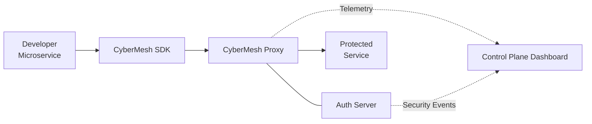
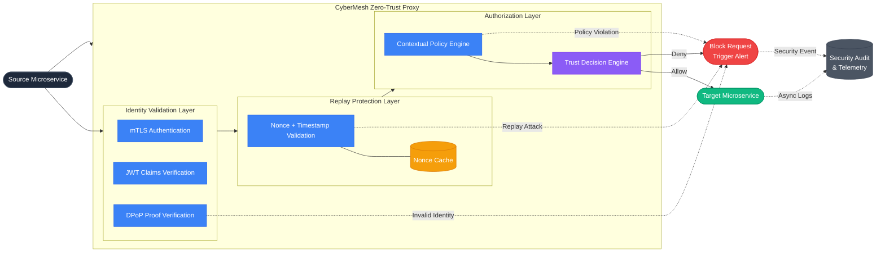

# CyberMesh — Zero-Trust Access Control for Decentralized APIs

> A lightweight zero-trust service mesh proxy that enforces cryptographic identity on every inter-service request, auto-learns traffic policies, and visualizes everything on a real-time dashboard.

**Innova Hack Chapter-1 | Round 2 | Domain: Cybersecurity**

---

## Quick Start

### Prerequisites
- [Docker Desktop](https://www.docker.com/products/docker-desktop/) (with Docker Compose v2)
- Python 3.12+ (for running the attack simulation script locally)
- Node.js 20+ (for dashboard development)

### 1. Start Everything
```bash
docker compose up --build
```

This starts:
| Service | Port | Description |
|---------|------|-------------|
| **CyberMesh Proxy** | `localhost:8080` | The zero-trust enforcement engine |
| **Dashboard** | `localhost:3000` | Real-time monitoring UI |
| Auth Service | `localhost:8081` | JWT issuance + revocation (internal) |
| User Service | internal only | Mock microservice |
| Billing Service | internal only | Mock microservice |
| Admin Service | internal only | Mock microservice (attack target) |

### 2. Open the Dashboard
```
http://localhost:3000
```

### 3. Run the Attack Simulation
```bash
# Install the script dependency
pip install httpx

# Full demo (30s learning + attacks)
python scripts/attack_simulation.py

# Fast mode (10s learning)
python scripts/attack_simulation.py --fast
```

### 4. Watch the Demo
The attack simulation runs through 4 phases:
1. **Learning Mode** — Normal traffic builds an auto-generated policy
2. **Enforce Mode** — Policy activated, all traffic verified
3. **Attack Simulation** — Lateral movement, rate abuse, SQL injection, forged tokens
4. **Revocation** — Kill-switch demo, instant access denial

---

## Architecture



## Request Workflow



## Key Features

### Cryptographic Identity
Every microservice gets a signed JWT (HS256, 60s TTL). The proxy verifies the signature on every single request — no persistent trust.

### Auto-Generated Policy (Learning Mode)
Switch to learning mode → the proxy watches real traffic for 30 seconds → auto-generates an allowlist policy from observed patterns. No hand-written YAML.

### Trust Score Engine
Every request is scored across 3 dimensions:
```
trust_score = (identity × 0.4) + (behavior × 0.3) + (context × 0.3)
```
- **> 80** → Allow
- **50-80** → Step-up re-authentication
- **< 50** → Block

### Risk Explanation Engine
Every block surfaces a full checklist of reasons, not just "blocked":
```
✗ [policy]     billing-service → admin-service NOT in learned policy
✗ [rate_limit] 14 req/s exceeds limit of 10 req/s
✓ [identity]   Valid JWT for billing-service
```

### In-Flight Revocation
Revoke a service's identity from the dashboard — its next request fails instantly, even with a valid token.

### Real-Time Dashboard
- Live event feed with color-coded decisions
- Service mesh graph visualization
- Threat timeline
- Trust score gauge with weight breakdown
- Per-service kill-switch buttons

---

## Project Structure

```
CyberMesh/
├── docker-compose.yml          # Orchestrates all services
├── auth-service/               # Mini-CA: JWT issuance + revocation
├── services/
│   ├── user-service/           # Mock microservice
│   ├── billing-service/        # Mock microservice
│   └── admin-service/          # Mock microservice (sensitive)
├── proxy/                      # CyberMesh Proxy (the core)
│   ├── main.py                 # FastAPI entry + all API routes
│   ├── identity.py             # JWT verification
│   ├── policy_engine.py        # Hardcoded + learned policy
│   ├── learning_mode.py        # Traffic observation + auto-policy
│   ├── trust_score.py          # Weighted trust score engine
│   ├── context_checks.py       # Rate limiting, time, payload anomaly
│   ├── risk_explanation.py     # Multi-reason breakdown builder
│   ├── event_stream.py         # SSE broadcaster
│   ├── revocation.py           # In-flight kill-switch
│   └── fallback_replay.py      # Demo replay from fixture
├── dashboard/                  # React (Vite) real-time dashboard
├── scripts/
│   ├── attack_simulation.py    # Automated demo script
│   └── fallback_fixture.json   # Pre-recorded demo events
└── shared/                     # Shared config + event schema
```

---

## Evaluation Metrics

| Metric | Target | How We Meet It |
|--------|--------|----------------|
| Proxy overhead latency | ≤ 15ms | Async Python, in-memory checks, measured per-request |
| Lateral movement detection | High | Auto-learned policy blocks unseen caller→target pairs |
| Dynamic token validation | Robust | Short-lived JWTs (60s), signature verification, revocation, step-up re-auth |

---

## Development

### Run services locally (without Docker)
```bash
# Terminal 1: Auth service
cd auth-service && pip install -r requirements.txt
uvicorn main:app --port 8081

# Terminal 2-4: Mock services
cd services/user-service && uvicorn main:app --port 8001
cd services/billing-service && uvicorn main:app --port 8002
cd services/admin-service && uvicorn main:app --port 8003

# Terminal 5: Proxy
cd proxy && pip install -r requirements.txt
PYTHONPATH=/path/to/CyberMesh uvicorn proxy.main:app --port 8080

# Terminal 6: Dashboard
cd dashboard && npm install && npm run dev
```

### API Endpoints (Proxy)
| Endpoint | Method | Description |
|----------|--------|-------------|
| `/health` | GET | Health check |
| `/events` | GET (SSE) | Live event stream |
| `/metrics` | GET | Aggregate stats |
| `/policy` | GET | Current active policy |
| `/mode` | POST | Switch learning/enforce/demo-replay |
| `/revoke/{service}` | POST | Revoke a service's identity |
| `/proxy/{target}/{path}` | ANY | Proxy catch-all route |
